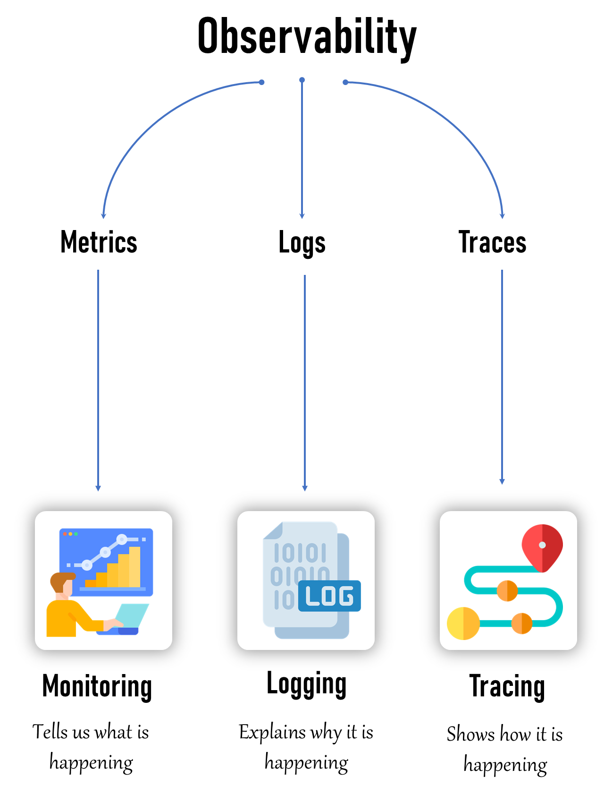
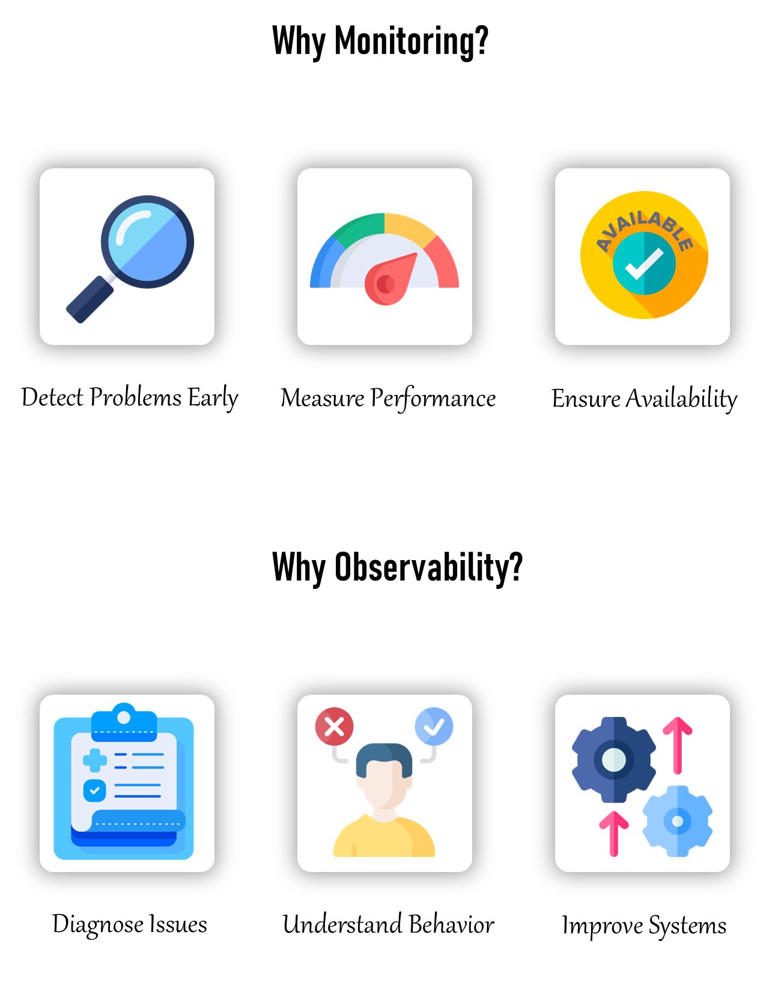

# 💡 Introduction à l’Observabilité

* L’observabilité est la capacité à comprendre l’état interne d’un système en analysant les données qu’il produit, telles que les **logs (journaux)**, les **métriques** et les **traces**.

* **Supervision (Monitoring – Métriques)** : consiste à suivre les métriques du système, comme l'utilisation du CPU, la mémoire et les performances réseau. Cela permet de générer des alertes basées sur des seuils prédéfinis.

  * *La supervision nous dit ce qui se passe.*

* **Journalisation (Logging – Journaux)** : consiste à collecter les journaux des différents composants du système.

  * *La journalisation explique pourquoi cela se produit.*

* **Traçabilité (Tracing – Traces)** : consiste à suivre le parcours d’une requête ou d’une transaction à travers différents services et composants.

  * *La traçabilité montre comment cela se produit.*

---

## 🤔 Pourquoi la Supervision ?

* La supervision nous aide à surveiller nos systèmes pour s'assurer qu'ils fonctionnent correctement.
* Objectif : maintenir la **santé**, les **performances** et la **sécurité** des environnements informatiques.
* Elle permet de détecter rapidement les problèmes et d’agir avant qu’ils ne provoquent des interruptions majeures ou des pertes de données.

### ✅ Cas d’usage :

* Détection précoce des problèmes.
* Mesure des performances.
* Garantie de la disponibilité.

---

## 🤔 Pourquoi l’Observabilité ?

* L’observabilité nous aide à comprendre pourquoi nos systèmes se comportent d’une certaine manière.
* C’est comme disposer d’une carte détaillée et d’outils pour explorer et diagnostiquer les problèmes.

### ✅ Cas d’usage :

* Diagnostiquer les incidents.
* Comprendre le comportement du système.
* Améliorer les systèmes.

---

## 🆚 Quelle est la Différence Exacte entre Supervision et Observabilité ?

* 🔥 La supervision répond au *"quoi et quand"* d’une anomalie, tandis que l’observabilité répond au *"pourquoi et comment"*.

| Catégorie | Supervision                                                  | Observabilité                                                       |
| --------- | ------------------------------------------------------------ | ------------------------------------------------------------------- |
| Objectif  | Vérifier que tout fonctionne comme prévu                     | Comprendre pourquoi les choses se passent dans le système           |
| Données   | Collecte des métriques (CPU, mémoire, erreurs…)              | Collecte journaux, métriques et traces pour une vision globale      |
| Alertes   | Alerte dès qu’un problème survient                           | Corrèle les événements et anomalies pour trouver les causes racines |
| Exemple   | CPU d’un serveur > 90% → alerte                              | Site lent → traçabilité de la requête pour trouver le blocage       |
| Analyse   | Identifie les problèmes avant qu'ils ne deviennent critiques | Aide à diagnostiquer et à comprendre le comportement global         |

---

## 🔭 L’Observabilité Englobe-t-elle la Supervision ?

* Oui ! La **supervision** est un **sous-ensemble** de l’observabilité.
* L’observabilité est un concept plus large, qui inclut la supervision.
* La supervision suit des métriques précises et déclenche des alertes sur des seuils définis.
* L’observabilité offre une vision complète en analysant un large éventail de données : **journaux, métriques et traces**.

---

## 🖥️ Que Peut-on Surveiller ?

* **Infrastructure** : utilisation CPU, mémoire, disque, trafic réseau.
* **Applications** : temps de réponse, taux d’erreur, débit.
* **Bases de données** : performance des requêtes, connexions, transactions.
* **Réseau** : latence, perte de paquets, bande passante.
* **Sécurité** : tentatives d’accès non autorisées, analyses de vulnérabilité, journaux de pare-feu.

---

## 👀 Que Peut-on Observer ?

* **Journaux (Logs)** : enregistrements détaillés des événements du système.
* **Métriques** : indicateurs quantitatifs (charge CPU, mémoire, nombre de requêtes).
* **Traces** : suivi du parcours des requêtes entre les services.

---

## 🆚 Supervision sur Serveurs Physiques (Bare-Metal) vs. Supervision sur Kubernetes

### Serveurs Physiques :

* Accès direct aux métriques matérielles et journaux.
* Environnement plus simple, avec peu de couches d’abstraction.

### Kubernetes :

* Environnement dynamique : surveillance difficile des conteneurs éphémères.
* Nature distribuée : nécessite des outils capables de gérer des systèmes distribués.

---

## 🆚 Observabilité sur Serveurs Physiques vs. Observabilité sur Kubernetes

### Serveurs Physiques :

* Observabilité plus simple : moins de composants, collecte plus directe.

### Kubernetes :

* Observabilité complexe : nécessite des outils avancés pour gérer la dynamique des conteneurs et microservices.
* Oblige à combiner plusieurs outils pour une vue complète du système.

---

## ⚒️ Quels Sont les Outils Disponibles ?

### **Outils de Supervision (Monitoring)** :

* Prometheus, Grafana, Nagios, Zabbix, PRTG.

### **Outils d’Observabilité** :

* ELK Stack (Elasticsearch, Logstash, Kibana),
* EFK Stack (Elasticsearch, FluentBit, Kibana),
* Splunk, Jaeger, Zipkin, New Relic, Dynatrace, Datadog.

# **SLA, SRE et CNCF – Notions Clés en Observabilité**

## **1. SLA (Service Level Agreement)**

Un **SLA (Accord de Niveau de Service)** est un **contrat formel** entre un fournisseur de services et un client, qui définit les niveaux de service attendus.

### **Éléments clés d’un SLA :**

* **Disponibilité (Uptime) :**
  Ex. *« Le service sera disponible à 99,9 % chaque mois. »*
* **Performance :**
  Ex. *« Les requêtes API répondront en moins de 200 ms dans 95 % des cas. »*
* **Support et assistance :**
  Ex. *« Les incidents critiques seront résolus en moins de 2 heures. »*
* **Pénalités :**
  Si le fournisseur ne respecte pas l’accord, il peut offrir des crédits ou un remboursement.

**Exemple :**
Un fournisseur cloud peut garantir une disponibilité de **99,99 %** par mois, soit un temps d’arrêt maximal de **\~4 minutes par mois**.

---

## **2. SRE (Site Reliability Engineering)**

Le **SRE** est une **approche d’ingénierie** (créée chez Google) visant à rendre les systèmes **fiables, scalables et efficaces**, en combinant **le développement logiciel** et **l’exploitation des systèmes**.

### **Objectifs du SRE :**

* Automatiser les tâches opérationnelles (déploiements, surveillance, scaling).
* Assurer la **fiabilité** tout en permettant des mises en production rapides.
* Mesurer la fiabilité à l’aide de **SLI, SLO et SLA**.

### **Concepts clés en SRE :**

* **SLI (Service Level Indicator) :** Un indicateur mesurant la qualité du service.
  *Exemple : disponibilité, latence, taux d’erreurs.*
* **SLO (Service Level Objective) :** Un objectif quantifiable pour un SLI.
  *Exemple : 99,9 % de disponibilité par mois.*
* **Error Budget :** La marge d’erreur tolérée avant de violer le SLO.

**Exemple :**
Si le SLO est 99,9 % d’uptime (43 min de panne/an), **l’error budget** correspond à ces 0,1 % de panne autorisée.

---

## **Différence entre SLA et SRE :**

* **SLA :** Contrat externe avec le client.
* **SRE :** Méthodologie interne pour respecter (ou dépasser) le SLA.

---

## **3. CNCF (Cloud Native Computing Foundation)**

### **Qu’est-ce que le CNCF ?**

Le **CNCF** est une fondation à but non lucratif (sous la Linux Foundation) qui promeut l’adoption des **technologies cloud-native**.
Elle héberge et soutient des projets open source modernes permettant de construire des applications **scalables, résilientes et portables**.

### **Points importants :**

* **Création :** 2015 (par Google et la Linux Foundation).
* **Mission :** Rendre le cloud-native **universel et durable**.
* **Projets phares :**

  * **Kubernetes** (orchestration de conteneurs)
  * **Prometheus** (monitoring et alerting)
  * **Envoy**, **gRPC**, **Helm**, **Fluentd**, **OpenTelemetry**, etc.
* **Certifications CNCF :**

  * **CKA (Certified Kubernetes Administrator)**
  * **CKAD (Certified Kubernetes Application Developer)**
  * **KCNA (Kubernetes and Cloud Native Associate)**

---

### **Cloud Native, c’est quoi ?**

Une application **cloud-native** est conçue pour tirer parti du cloud grâce à :

* Des **conteneurs** (Docker),
* Une architecture **microservices**,
* L’orchestration **dynamique** (Kubernetes),
* Des **API déclaratives**,
* Des pratiques **DevOps et CI/CD**.

---

### **4. Signification du sigle CNCF**

* **C** = **Cloud**
* **N** = **Native**
* **C** = **Computing**
* **F** = **Foundation**

